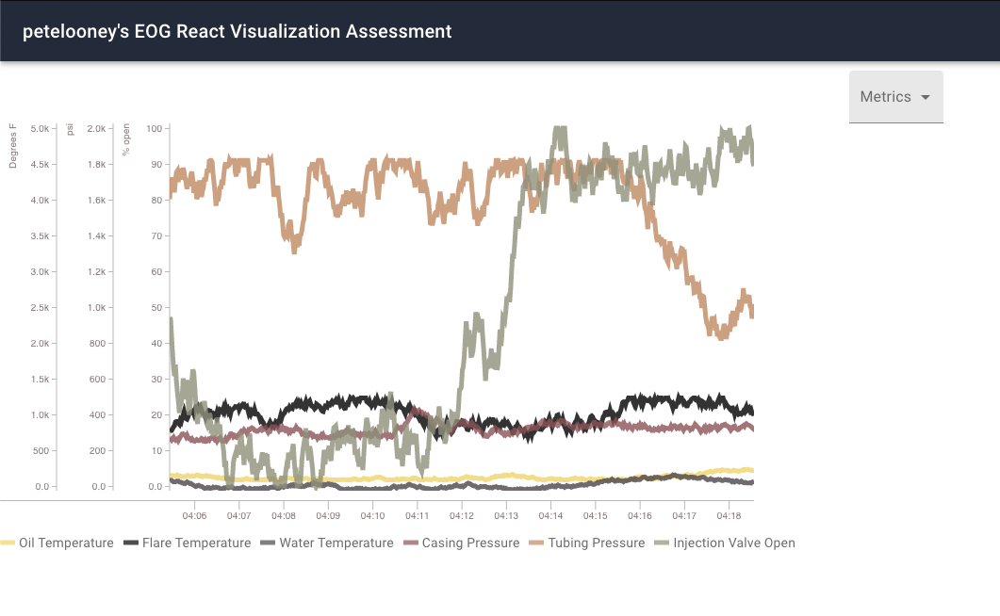

# Welcome <!-- omit in toc -->
  
## **About this repository**
* This repository houses assessment code that I completed for EOG's React Assessment.
* The site uses Graphql, React, Redux, and React-Timeseries-charts to render 6 different pieces of measurements including:
  * Oil Temperature
  * Tubing Pressure
  * Casing Pressure
  * Water Temperature
  * Injection Vavlue Open Percentage
  * Flare Temperature

## **General**
* Using EOG's starter code as a foundation, I expanded the site to include a graph that highlights the data points from above.

## **Lessons Learned**
* How to use graphql
  * Like I try and do with all new concepts, I spent time reviewing the graphql documentation and studying examples before diving into writing queries. 
  * Ultimately, I found that I enjoyed using graphql and plan on expanding my knowledge in the platform.
* How to use React-Timeseries-Charts
  * This package assists in creating a multitude of time series charts. 
  * I decided to use their Line chart graphing component, as I felt this would best suite the data in question.

# Thanks for visiting!